<p align="center">
  <a href="https://github.com/simonepri/refined-antigravity-acp">
    
  </a>
</p>

<h1 align="center">Refined Antigravity ACP</h1>

<p align="center">
  <!-- Implementation -->
  <a href="https://www.typescriptlang.org/">
    
  </a>
  <a href="https://nodejs.org/">
    =22-339933?logo=node.js&amp;logoColor=white" alt="Node.js 22+">
  </a>
  <a href="https://pnpm.io/">
    
  </a>
  <a href="https://oxc.rs/">
    
  </a>
  <br>
  <!-- Verification -->
  <a href="https://github.com/simonepri/refined-antigravity-acp/actions/workflows/ci.yml">
    
  </a>
  <a href="https://vitest.dev/">
    
  </a>
  <br>
  <!-- Distribution -->
  <a href="https://github.com/googleapis/release-please">
    
  </a>
  <a href="https://github.com/getpaseo/paseo">
    
  </a>
  <a href="license">
    
  </a>
</p>

<p align="center">
  <strong>A hardened wrapper around Google's official Antigravity ACP binary.</strong>
</p>

---

## What is Refined Antigravity ACP?

**Refined Antigravity ACP** is an **proxy wrapper** around Google's official Antigravity ACP binary ([`agy_acp_server.par`](https://dl.google.com/agy-extensions/releases/)).

Google's binary powers the core model execution, agent loop, and tool calling. This project intercepts the ACP stream between your editor and the server to transparently fix upstream bugs (such as turn completion and subagent hangs), absorb malformed MCP traffic, and provide first-class integration for **Paseo**, **Zed**, and any standard ACP client.

```mermaid
flowchart LR
    subgraph Editors["Supported ACP Clients"]
        PaseoUI["Paseo<br>(Native Plugin)"]
        ZedUI["Zed Editor<br>(Stdio Agent)"]
        OtherUI["Neovim / JetBrains / Custom<br>(Standard ACP)"]
    end

    subgraph Wrapper["Refined Antigravity ACP"]
        Connector["Stream Connector<br>(src/connector.ts)"]
        HangDetector["Hang & Turn-Complete Detector<br>(Grace Timers + Synthetic end_turn)"]
        McpProxy["Loopback MCP Proxy<br>(Header Normalization & 4xx Absorption)"]
        Steering["Mid-Flight Steering<br>(src/steering.ts)"]
        SkillsEngine["Slash Skills Autocomplete<br>(src/skills.ts)"]
        Sanitizer["Stream Sanitizer<br>(Markup & Internal Tag Stripping)"]
        AgyPatch["Binary Patch Engine<br>(Zero-Offset Byte Preservation)"]

        Connector --- HangDetector
        Connector --- McpProxy
        Connector --- Steering
        Connector --- SkillsEngine
        Connector --- Sanitizer
        Connector --- AgyPatch
    end

    subgraph Upstream["Google Official Backend"]
        Kernel["agy_acp_server.par<br>(Google Subprocess)"]
        GeminiCloud["Google DeepMind / Gemini Cloud"]
        Kernel <-->|"gRPC / HTTPS"| GeminiCloud
    end

    PaseoUI <-->|"In-Process Provider Plugin"| Wrapper
    ZedUI <-->|"Stdio NDJSON (CLI)"| Wrapper
    OtherUI <-->|"Stdio NDJSON (CLI)"| Wrapper
    Wrapper <-->|"Standard ACP (NDJSON)"| Kernel

    classDef editor fill:#20744A,stroke:#10B981,color:#fff,stroke-width:2px;
    classDef wrapper fill:#0F172A,stroke:#3B82F6,color:#fff,stroke-width:2px;
    classDef google fill:#1E293B,stroke:#64748B,color:#fff,stroke-width:2px;

    class PaseoUI,ZedUI,OtherUI editor;
    class Connector,HangDetector,McpProxy,Steering,SkillsEngine,Sanitizer,AgyPatch wrapper;
    class Kernel,GeminiCloud google;
```



---

## What Does This ACP Give You?

### Upstream Bugfixes & Hardening

| Area                                       | Upstream Issue                                                                                                   | Mitigation in Refined ACP                                                                                                    |
| :----------------------------------------- | :--------------------------------------------------------------------------------------------------------------- | :--------------------------------------------------------------------------------------------------------------------------- |
| 🛡️ **Subagent & Task Hangs**               | Upstream binary permanently wedges in `STATE_WAITING_FOR_TASKS` when launching subagents or background tasks.    | 3-layer defense: automated non-destructive binary patch, stderr telemetry hang detection, and transparent process recycling. |
| ⏳ **Turn Completion & Infinite Spinners** | Upstream omits the final JSON-RPC prompt response after completing user turns, leaving editors spinning forever. | Stream-detects `TARGET_USER` `STATE_DONE` telemetry, runs a 5s grace timer, and fires synthetic `end_turn` completions.      |
| 🔌 **MCP Header & 4xx Fatal Crashes**      | Upstream Go SDK harnesses crash fatally on notification 4xx HTTP responses or missing `Accept` headers.          | In-process loopback MCP proxy normalizes headers and absorbs notification 4xx errors with HTTP `202 Accepted`.               |
| 🧼 **Internal Markup Leaks**               | Raw harness internal markers (`<system_message>`, `<context>`, `<messaging>`) leak into user output.             | Live stream sanitizer strips internal tags and converts raw HTML elements into clean Markdown.                               |

### Enhanced Capabilities

| Feature                                   | Description                                                                                                                                    |
| :---------------------------------------- | :--------------------------------------------------------------------------------------------------------------------------------------------- |
| 🎯 **Mid-Turn Steering (`prompt.steer`)** | Steer running agent turns in flight without interrupting execution or losing context. Cleanly strips steering markers from saved history.      |
| 🔄 **Session History Recovery**           | Automatically discovers and restores previous conversation history directly from the local Antigravity SQLite database on session reload.      |
| ⚡ **Workspace Slash Skills Discovery**   | Discovers skill definitions in `.gemini/skills`, `.agents/skills`, `.codex/skills`, and global paths, exposing them as autocomplete commands.  |
| 🧠 **Workspace Context Injection**        | Seamlessly injects project profile instructions and system prompts during session initialization without duplicate re-injections across turns. |
| 🔐 **Zero-Touch Authentication**          | Reuses existing Google CLI credentials from macOS Keychain or `acp_token.json` without requiring browser re-login.                             |

---

## Editor Support & Setup

### 1. Paseo (Native Provider Plugin)

Refined Antigravity ACP runs natively as an in-process Paseo provider plugin.

#### Installation

**Option A: Native Plugin via Paseo CLI (Recommended)**

```bash
paseo plugin add @simonepri/refined-antigravity-acp
```

**Option B: Manual Provider Configuration (`~/.paseo/config.json`)**

You can also register it directly as an ACP agent provider in your `~/.paseo/config.json` under `agents.providers`:

```json
{
  "agents": {
    "providers": {
      "antigravity": {
        "extends": "acp",
        "label": "Antigravity",
        "command": ["npx", "-y", "@simonepri/refined-antigravity-acp"],
        "enabled": true
      }
    }
  }
}
```

_(Alternatively, install globally via `npm install -g @simonepri/refined-antigravity-acp` or `pnpm add -g @simonepri/refined-antigravity-acp` and configure `["refined-antigravity-acp"]` or the absolute path from `which refined-antigravity-acp`)._

---

### 2. Zed Editor (ACP Agent)

Zed supports external agents via the Agent Client Protocol over stdio.

#### Configuration

Add `refined-antigravity-acp` to your Zed `settings.json` (accessible via `Cmd+,` or `~/.config/zed/settings.json`) under `agent.profiles`.

You can configure it using `npx` (zero-install) or by pointing directly to your local binary path:

**Via npx (Zero-install):**

```json
{
  "agent": {
    "profiles": {
      "antigravity": {
        "type": "acp",
        "command": "npx",
        "args": ["-y", "@simonepri/refined-antigravity-acp"]
      }
    }
  }
}
```

**Via Local / Global Binary Path:**

If you installed the package globally (`npm install -g @simonepri/refined-antigravity-acp`) or cloned it locally, find the binary path via `which refined-antigravity-acp` and provide the absolute path to `command`:

```json
{
  "agent": {
    "profiles": {
      "antigravity": {
        "type": "acp",
        "command": "/usr/local/bin/refined-antigravity-acp",
        "args": []
      }
    }
  }
}
```

---

### 3. Standalone CLI / Other ACP Editors (Neovim, JetBrains)

Any editor or tool speaking standard ACP over stdio can launch Refined Antigravity ACP directly:

```bash
npx @simonepri/refined-antigravity-acp
```

Or install globally:

```bash
npm install -g @simonepri/refined-antigravity-acp
refined-antigravity-acp
```

> [!TIP]
> The wrapper automatically resolves or downloads the official Google [`agy_acp_server.par`](https://dl.google.com/agy-extensions/releases/) binary if it is not already present on your machine.

---

## Authentication

If you already use Google Antigravity on your machine, you are already authenticated! The wrapper reads your existing credentials from macOS Keychain or `~/.gemini/antigravity-acp/acp_token.json`.

If starting fresh on a new machine, authenticate once via the Google CLI:

```bash
agy
```

---

## Behavioral Notes

> [!NOTE]
> **Tool execution priority**: Google Antigravity models prioritize immediate tool execution over conversational chat. When starting a prompt or responding after an interruption, the agent will typically call required tools immediately rather than outputting a preliminary text acknowledgment.
>
> If you prefer the agent to verbally state its intentions before calling tools, you can configure your Paseo agent or profile system prompt (e.g., in `.paseo/profile.json` or agent instructions) to include:
>
> ```text
> Before calling any tools, always output a concise 1-2 sentence acknowledgment outlining what you are about to do.
> ```

---

## Configuration & Environment Variables

| Variable                       | Default       | Description                                                                                |
| :----------------------------- | :------------ | :----------------------------------------------------------------------------------------- |
| `PASEO_AGY_ACP_BIN`            | Auto-detected | Custom path to an `agy_acp_server.par` binary.                                             |
| `PASEO_AGY_NO_PATCH`           | `0`           | Set to `1` to disable binary auto-patching and force the unmodified binary.                |
| `PASEO_AGY_HANG_GRACE_MS`      | `5000`        | Grace period in milliseconds after `STATE_WAITING_FOR_TASKS` before declaring a turn hung. |
| `PASEO_AGY_HANG_INACTIVITY_MS` | `30000`       | Inactivity backstop timer (30 seconds) before declaring a turn hung.                       |
| `PASEO_AGY_RECYCLE_TIMEOUT_MS` | `30000`       | Maximum time allowed to spawn and initialize a recycled replacement process.               |
| `PASEO_AGY_TRACE`              | `0`           | Set to `1` to trace all inbound and outbound ACP JSON-RPC messages to stderr.              |
| `PASEO_AGY_MCP_PROXY_PORT`     | `0`           | Fixed port for the loopback MCP proxy (defaults to an ephemeral open port).                |
| `ANTIGRAVITY_HARNESS_PATH`     | Auto-detected | Explicit path to the Antigravity Python harness.                                           |

---

## Development

```bash
pnpm install
pnpm run format:check
pnpm run lint
pnpm run dead-code
pnpm run typecheck
pnpm run test
```

---

## Disclaimer

This is an independent open-source project and is not affiliated with, authorized, or endorsed by Google LLC. "Antigravity", "Gemini", and Google are trademarks of Google LLC.

---

## License

MIT © [Simone Primarosa](https://github.com/simonepri)
