<p align="center">
  <a href="https://github.com/simonepri/refined-antigravity-acp">
    
  </a>
</p>

<h1 align="center">Refined Antigravity ACP</h1>

<p align="center">
  <!-- Implementation -->
  <a href="https://www.typescriptlang.org/">
    
  </a>
  <a href="https://nodejs.org/">
    =22-339933?logo=node.js&amp;logoColor=white" alt="Node.js 22+">
  </a>
  <a href="https://pnpm.io/">
    
  </a>
  <br>
  <!-- Quality & Tooling -->
  <a href="https://oxc.rs/">
    
  </a>
  <a href="https://oxc.rs/">
    
  </a>
  <a href="https://publint.dev/">
    
  </a>
  <a href="https://github.com/trumppet/fallow">
    
  </a>
  <a href="https://github.com/rhysd/actionlint">
    
  </a>
  <br>
  <!-- Verification -->
  <a href="https://github.com/simonepri/refined-antigravity-acp/actions/workflows/ci.yml">
    
  </a>
  <a href="https://vitest.dev/">
    
  </a>
  <br>
  <!-- Distribution -->
  <a href="https://www.npmjs.com/package/@simonepri/refined-antigravity-acp">
    
  </a>
  <a href="https://github.com/simonepri/refined-antigravity-acp/stargazers">
    
  </a>
  <a href="https://github.com/googleapis/release-please">
    
  </a>
  <a href="https://github.com/getpaseo/paseo">
    
  </a>
  <a href="license">
    
  </a>
</p>

<p align="center">
  <strong>🤦 A Google Antigravity ACP binary that actually works.</strong>
</p>

---

## Overview

**Refined Antigravity ACP** is a proxy wrapper around Google's official Antigravity ACP binary (`agy_acp_server.par`).

Google's binary executes models, agent loops, and tool calls. This proxy intercepts the ACP stream between editor and server to fix upstream crashes and deadlocks, normalize MCP traffic, and integrate with **Paseo**, **Zed**, and other ACP clients.

```mermaid
flowchart LR
    subgraph Editors["Supported ACP Clients"]
        PaseoUI["Paseo<br>(ACP Agent Provider)"]
        ZedUI["Zed Editor<br>(Stdio Agent)"]
        OtherUI["Neovim / JetBrains / Custom<br>(Standard ACP)"]
    end

    subgraph Wrapper["Refined Antigravity ACP (Proxy & Hardening Layer)"]
        direction TB

        Supervisor["Process Supervisor<br>• Subprocess Lifecycle & Health<br>• Transparent Crash Recovery<br>• Multi-Session State Cache"]

        subgraph Pipeline["Bidirectional ACP Pipeline"]
            direction TB
            Outbound["Outbound Stream<br>• Request & Option Normalization<br>• Workspace Context Injection<br>• MCP Port & URL Rewriting"]
            Inbound["Inbound Stream<br>• Output & Stream Sanitization<br>• Progress & Plan Synthesis<br>• Interruption Leak Cleanup"]
            Telemetry["Telemetry & Diagnostics<br>• Real-time Stderr Event Tracking<br>• SQLite Checkpoint & History Repair<br>• Token Usage Extraction"]
        end

        McpProxy["Loopback MCP Proxy Pool<br>• Dynamic Endpoint Remapping<br>• Protocol Version Adaptation"]

        Supervisor <--> Pipeline
        Supervisor <--> McpProxy
    end

    subgraph Upstream["Google Official Backend"]
        Kernel["agy_acp_server.par<br>(Google Subprocess)"]
        LocalDb[(Local SQLite Store<br>Conversations & Steps)]
        GeminiCloud["Google DeepMind / Gemini Cloud"]

        Kernel <-->|gRPC / HTTPS| GeminiCloud
        Kernel <-->|WAL Journal| LocalDb
    end

    Editors <-->|Stdio NDJSON CLI| Supervisor
    Supervisor <-->|Standard ACP NDJSON| Kernel
    Pipeline -.->|Direct Read / Heal| LocalDb
    McpProxy <-->|HTTP Rewriting| Kernel

    classDef editor fill:#20744A,stroke:#10B981,color:#fff,stroke-width:2px
    classDef wrapper fill:#0F172A,stroke:#3B82F6,color:#fff,stroke-width:2px
    classDef component fill:#1E293B,stroke:#60A5FA,color:#fff,stroke-width:1px
    classDef google fill:#18181B,stroke:#71717A,color:#fff,stroke-width:2px
    classDef db fill:#312E81,stroke:#818CF8,color:#fff,stroke-width:2px

    class PaseoUI,ZedUI,OtherUI editor
    class Supervisor,Pipeline,McpProxy,Outbound,Inbound,Telemetry component
    class Kernel,GeminiCloud google
    class LocalDb db
```



The matrix below documents upstream defects across process startup, turn execution, cancellation, and session replay. Each entry links directly to tests demonstrating the defect (**Problem**) and the fix (**Solution**).

> [!TIP]
>
> ### ⭐️ Help Retire These Patches
>
> Refined Antigravity ACP is a transitional hardening layer. When Google resolves a defect in an official release, the corresponding problem test verifies the fix and the wrapper retires the patch.
>
> To help prioritize upstream fixes:
>
> - **Star the repository**: Community visibility signals to the Google Antigravity team which upstream defects impact real users.
> - **Report new issues**: If you encounter an unhandled crash, deadlock, or protocol edge case, [open an issue](https://github.com/simonepri/refined-antigravity-acp/issues). Every report includes a reproducible problem test and a solution test.

| Defect                                                                               | Upstream Problem                                                                                                                                                                                                                                                                                              | Solution                                                                                                                                                                                                                                                                                                              |
| :----------------------------------------------------------------------------------- | :------------------------------------------------------------------------------------------------------------------------------------------------------------------------------------------------------------------------------------------------------------------------------------------------------------ | :-------------------------------------------------------------------------------------------------------------------------------------------------------------------------------------------------------------------------------------------------------------------------------------------------------------------- |
| [**Missing Localharness Binary**](src/fixes/missing-localharness/index.ts)           | **Problem**: `agy_acp_server` invokes sibling `./localharness_external`. When relocated or spawned in an isolated directory without `$ANTIGRAVITY_HARNESS_PATH`, it crashes on `session/new`.<br>🔗 [`problem: startup crash`](src/fixes/missing-localharness/index.e2e.test.ts#L20)                          | Searches standard install paths, downloads the official package if missing, and exports the resolved `$ANTIGRAVITY_HARNESS_PATH`.<br>🔗 [`solution: harness resolution`](src/fixes/missing-localharness/index.e2e.test.ts#L38)                                                                                        |
| [**Missing Custom System Prompt**](src/fixes/missing-system-prompt/index.ts)         | **Problem**: Stock ACP protocol does not support injecting custom workspace rules, agent personas, or profile system prompts.<br>🔗 [`problem: missing system prompt context`](src/fixes/missing-system-prompt/index.e2e.test.ts#L6)                                                                          | Injects client-configured `systemPrompt` (via `_meta.systemPrompt` or nested `_meta.<client>.systemPrompt`) and tool visibility guidance into prompt turns without polluting saved history.<br>🔗 [`solution: prompt injection`](src/fixes/missing-system-prompt/index.e2e.test.ts#L15)                               |
| [**Unadvertised Workspace Slash Skills**](src/fixes/missing-slash-skills/index.ts)   | **Problem**: Raw ACP only advertises built-in model commands and ignores custom workspace skills defined in `.agents/skills` or `.gemini/skills`.<br>🔗 [`problem: missing slash skills`](src/fixes/missing-slash-skills/index.e2e.test.ts#L40)                                                               | Discovers `SKILL.md` files across all configured workspace directories and dynamically augments `available_commands_update`.<br>🔗 [`solution: skill augmentation`](src/fixes/missing-slash-skills/index.e2e.test.ts#L73)                                                                                             |
| [**Subagent Deadlock & Hang**](src/fixes/subagent-hang/index.ts)                     | **Problem**: Subprocesses can enter unmonitored hangs or panic (`could not find doneCh for checkpoint`) during background task execution.<br>🔗 [`problem: unmonitored hang`](src/fixes/subagent-hang/index.e2e.test.ts#L7)                                                                                   | Monitors telemetry activity and stderr panics to trigger process recycling without mutating upstream Python bytecode.<br>🔗 [`solution: hang telemetry recycling`](src/fixes/subagent-hang/index.e2e.test.ts#L22)                                                                                                     |
| [**Malformed Stream Syntax & LaTeX**](src/fixes/malformed-stream-syntax/index.ts)    | **Problem**: LLM outputs unquoted node labels with parentheses (`id[Label (Prod)]`) and raw LaTeX math (`\\le`), crashing frontend Mermaid and markdown parsers.<br>🔗 [`problem: syntax normalization`](src/fixes/malformed-stream-syntax/index.e2e.test.ts#L42)                                             | Wraps parenthetical labels in quotes `["..."`] and converts LaTeX escapes to clean Unicode characters (`≤`, `→`, `≠`) across streaming chunks.<br>🔗 [`solution: stream sanitizer`](src/fixes/malformed-stream-syntax/index.e2e.test.ts#L42)                                                                          |
| [**Active Foreground Turn Collision**](src/fixes/active-turn-collision/index.ts)     | **Problem**: Sending a prompt while the model is executing tool calls either crashes or is rejected with _"A foreground turn is already active"_.<br>🔗 [`problem: foreground active collision`](src/fixes/active-turn-collision/index.e2e.test.ts#L13)                                                       | Categorizes mid-turn inputs (side questions, course corrections, or stop requests) with non-destructive steering directives and prompt retries.<br>🔗 [`solution: user steering`](src/fixes/active-turn-collision/index.e2e.test.ts#L26)                                                                              |
| [**Interruption Cancellation Leak**](src/fixes/cancellation-leak/index.ts)           | **Problem**: Interrupted turns leak raw internal Go/Python cancellation exception strings (_"context canceledThe request was cancelled by the client."_) directly into assistant message chunks.<br>🔗 [`problem: raw cancellation leak`](src/fixes/cancellation-leak/index.e2e.test.ts#L6)                   | Drops raw upstream cancellation error chunks so editor chat feeds remain clean on interruption.<br>🔗 [`solution: cancellation drop`](src/fixes/cancellation-leak/index.e2e.test.ts#L11)                                                                                                                              |
| [**Stale Ephemeral MCP Endpoints**](src/fixes/stale-mcp-endpoints/index.ts)          | **Problem**: When a hung child process is recycled, resending initial `mcpServers` with outdated localhost ports fails because proxy endpoints have changed.<br>🔗 [`problem: stale proxy port`](src/fixes/stale-mcp-endpoints/index.e2e.test.ts#L20)                                                         | Uses `McpProxyPool` to dynamically intercept, remap, and heal MCP tool URLs across process restarts.<br>🔗 [`solution: proxy URL remapping`](src/fixes/stale-mcp-endpoints/index.e2e.test.ts#L20)                                                                                                                     |
| [**Orphaned SQLite Checkpoints**](src/fixes/orphaned-checkpoints/index.ts)           | **Problem**: Canceling a turn leaves in-progress checkpoints uncommitted in SQLite, causing fatal panics (_"could not find doneCh for checkpoint"_) on future turns.<br>🔗 [`problem: orphaned checkpoint`](src/fixes/orphaned-checkpoints/index.e2e.test.ts#L11)                                             | Scans the session SQLite database on startup and teardown, updating orphaned in-progress checkpoints to `ABORTED` (status 5).<br>🔗 [`solution: checkpoint repair`](src/fixes/orphaned-checkpoints/index.e2e.test.ts#L42)                                                                                             |
| [**Unscoped Database Corruptions**](src/fixes/orphaned-checkpoints/index.ts)         | **Problem**: Global database repair scans would mutate concurrent session databases across open tabs, corrupting active turns.<br>🔗 [`problem: concurrent tab safety`](src/fixes/orphaned-checkpoints/index.e2e.test.ts#L78)                                                                                 | Scopes checkpoint repair strictly to the target `sessionId.db`, isolating concurrent editor tabs.<br>🔗 [`solution: scoped session repair`](src/fixes/orphaned-checkpoints/index.e2e.test.ts#L117)                                                                                                                    |
| [**Database Concurrency Lockout**](src/fixes/orphaned-checkpoints/index.ts)          | **Problem**: Raw `DatabaseSync` without busy timeout throws `SQLITE_BUSY: database is locked` when reading conversation steps during active writes.<br>🔗 [`problem: raw sqlite busy error`](src/fixes/orphaned-checkpoints/index.ts#L41)                                                                     | Configures all database connections with `timeout: 2000` to wait out locks during concurrent reads and writes.<br>🔗 [`solution: sqlite timeout wait`](src/fixes/orphaned-checkpoints/index.ts#L41)                                                                                                                   |
| [**Dropped History Chunks on Load**](src/fixes/dropped-history-chunks/index.ts)      | **Problem**: Raw `agy_acp_server` drops thought chains and agent message chunks during `session/load`, loading an incomplete history.<br>🔗 [`problem: dropped history chunks`](src/fixes/dropped-history-chunks/index.e2e.test.ts#L53)                                                                       | Directly inspects protobuf steps in SQLite and reconstructs missing thought and message update events.<br>🔗 [`solution: sqlite history reconstruction`](src/fixes/dropped-history-chunks/index.e2e.test.ts#L99)                                                                                                      |
| [**Noisy WebSocket stderr Logs**](src/fixes/noisy-stderr-logs/index.ts)              | **Problem**: Upstream binary dumps unbuffered `RAW WS MSG:` debug payloads to stderr, flooding editor logs.<br>🔗 [`problem: stderr noise`](src/fixes/noisy-stderr-logs/index.e2e.test.ts#L16)                                                                                                                | Filters noisy websocket trace logs from stderr by default, exposing them only when `REFINED_AGY_TRACE=1` is explicitly set.<br>🔗 [`solution: stderr filter`](src/fixes/noisy-stderr-logs/index.e2e.test.ts#L16)                                                                                                      |
| [**Flattened Model Variants & Efforts**](src/fixes/flattened-model-efforts/index.ts) | **Problem**: Upstream binary flattens all model and reasoning variants into a confusing 11-item flat dropdown list (`gemini-3.8-flash-high`, `gemini-pro-agent`, etc.) without dedicated reasoning controls.<br>🔗 [`problem: flattened model list`](src/fixes/flattened-model-efforts/index.e2e.test.ts#L14) | Decomposes upstream models into clean base model choices (`gemini-3.8-flash`, `gemini-3.1-pro`, etc.) and injects standard reasoning effort controls (`high`, `medium`, `low`), translating settings upstream.<br>🔗 [`solution: decomposed effort options`](src/fixes/flattened-model-efforts/index.e2e.test.ts#L34) |
| [**Non-Canonical Mode ID Rejection**](src/fixes/non-canonical-mode-ids/index.ts)     | **Problem**: Upstream binary expects internal mode IDs (`auto_edit`, `yolo`, `default`) and rejects standard Paseo mode identifiers like `accept-edits`, `dangerously-skip-permissions`, and `plan`.<br>🔗 [`problem: mode rejection`](src/fixes/non-canonical-mode-ids/index.e2e.test.ts#L14)                | Translates client mode aliases to canonical internal IDs across outbound requests, session reloads, and child restarts.<br>🔗 [`solution: mode normalization`](src/fixes/non-canonical-mode-ids/index.e2e.test.ts#L32)                                                                                                |
| [**Silent Background Task Execution**](src/fixes/silent-background-tasks/index.ts)   | **Problem**: Subagents and background tasks execute silently; upstream binary produces no stdout chunks during `STATE_WAITING_FOR_TASKS`, leaving editor UIs frozen.<br>🔗 [`problem: silent background tasks`](src/fixes/silent-background-tasks/index.e2e.test.ts#L6)                                       | Synthesizes standard ACP `session/update` plan notifications (`sessionUpdate: "plan"`) tracking active subagent roles and background tasks with live progress and completion.<br>🔗 [`solution: plan synthesis`](src/fixes/silent-background-tasks/index.e2e.test.ts#L12)                                             |
| [**Missing Usage & Token Metrics**](src/fixes/missing-usage-metrics/index.ts)        | **Problem**: Upstream binary never emits ACP `usage_update` notifications, leaving editor context window meters blank.<br>🔗 [`problem: missing usage metrics`](src/fixes/missing-usage-metrics/index.e2e.test.ts#L14)                                                                                        | Intercepts SQLite step metadata to extract token counts and emits standard ACP `sessionUpdate: "usage_update"` with `usedTokens` and `maxTokens`.<br>🔗 [`solution: token usage synthesis`](src/fixes/missing-usage-metrics/index.e2e.test.ts#L35)                                                                    |
| [**Dangling Running Tool Calls**](src/fixes/dangling-tool-calls/index.ts)            | **Problem**: When commands are backgrounded, upstream never emits terminal `tool_call_update` with `status: "completed"`, leaving editor UIs with an infinite active running animation.<br>🔗 [`problem: dangling running tool call`](src/fixes/dangling-tool-calls/index.test.ts#L67)                        | Tracks active tool calls and marks backgrounded tools completed immediately, before assistant text streams, and upon turn completion.<br>🔗 [`solution: tool call auto-completion`](src/fixes/dangling-tool-calls/index.test.ts#L79)                                                                                  |
| [**Forbidden Question Other Option**](src/fixes/missing-question-fallback/index.ts)  | **Problem**: Upstream instructs the model not to provide an 'Other' option (`"Do NOT add an 'Other' option to questions"`), stranding users in multiple-choice prompts when none of the choices apply.<br>🔗 [`problem: missing other option`](src/fixes/missing-question-fallback/index.test.ts#L14)         | Steers the model to always include an 'Other' choice and appends a fallback 'Other' option to inbound `ask_question` tool calls.<br>🔗 [`solution: option fallback`](src/fixes/missing-question-fallback/index.test.ts#L14)                                                                                           |
| [**Premature Empty Turn Stop**](src/fixes/premature-turn-stop/index.ts)              | **Problem**: Upstream binary prematurely concludes prompt turns with empty completions (`stopReason=16`) without emitting assistant message chunks, leaving editor UIs frozen in silence.<br>🔗 [`problem: premature turn termination`](src/fixes/premature-turn-stop/index.test.ts#L67)                      | Tracks prompt turn state, injects explicit steering instructions, and synthesizes status messages when upstream ends a turn without speaking.<br>🔗 [`solution: empty turn recovery`](src/fixes/premature-turn-stop/index.test.ts#L106)                                                                               |

## Setup

### Automatic Configuration (Recommended)

Run the one-line setup command to install and configure both Paseo and Zed:

```bash
pnpm add -g @simonepri/refined-antigravity-acp && refined-antigravity-acp setup
```

To configure a specific editor only:

```bash
refined-antigravity-acp setup paseo   # Configures ~/.paseo/config.json & restarts daemon
refined-antigravity-acp setup zed     # Configures Zed settings.json
```

The setup command resolves your active Node runtime (`process.execPath`) and global CLI path automatically, handles Zed JSONC comments safely, and restarts the Paseo daemon.

---

### Manual Configuration

Install globally:

```bash
pnpm add -g @simonepri/refined-antigravity-acp
```

Locate installed binary paths:

```bash
which node
which refined-antigravity-acp
which pnpm
```

> [!TIP]
> The wrapper downloads `agy_acp_server.par` if not already installed locally.

---

### 1. Paseo (ACP Agent Provider)

Register the wrapper in `~/.paseo/config.json` under `agents.providers`:

#### Global Binary (Recommended)

```json
{
  "agents": {
    "providers": {
      "refined-antigravity-acp": {
        "extends": "acp",
        "label": "Antigravity",
        "command": ["<node-path>", "<refined-antigravity-acp-path>"],
        "enabled": true
      }
    }
  }
}
```

> [!NOTE]
> The Paseo daemon runs outside the login shell environment. Providing absolute paths from `which node` and `which refined-antigravity-acp` prevents `env: node: No such file or directory` errors.

#### Zero-Install (pnpm dlx)

```json
{
  "agents": {
    "providers": {
      "refined-antigravity-acp": {
        "extends": "acp",
        "label": "Antigravity",
        "command": ["<pnpm-path>", "dlx", "@simonepri/refined-antigravity-acp"],
        "enabled": true
      }
    }
  }
}
```

Restart the Paseo daemon after modifying `config.json`:

```bash
paseo daemon restart
```

---

### 2. Zed Editor (ACP Agent)

Add `refined-antigravity-acp` to your Zed `settings.json` under `agent.profiles`:

#### Global Binary (Recommended)

```json
{
  "agent": {
    "profiles": {
      "antigravity": {
        "type": "acp",
        "command": "<node-path>",
        "args": ["<refined-antigravity-acp-path>"]
      }
    }
  }
}
```

> [!NOTE]
> Zed launches external agent processes without inheriting shell version manager PATH variables. Explicit paths from `which node` and `which refined-antigravity-acp` ensure reliable execution.

#### Zero-Install (pnpm dlx)

```json
{
  "agent": {
    "profiles": {
      "antigravity": {
        "type": "acp",
        "command": "<pnpm-path>",
        "args": ["dlx", "@simonepri/refined-antigravity-acp"]
      }
    }
  }
}
```

---

### 3. Standalone CLI and Other ACP Editors

Run directly from any terminal or editor speaking standard ACP over stdio:

```bash
refined-antigravity-acp
```

Zero-install alternative: `pnpm dlx @simonepri/refined-antigravity-acp`.

---

## Authentication

Google's ACP server handles authentication directly. On initialization, the server advertises standard ACP `authMethods` (Google OAuth, Gemini Enterprise, Gemini API keys, or Agent Platform).

For OAuth logins, the server runs a local browser login flow and saves credentials to the operating system keychain. The CLI requires no manual authentication step.

---

## Configuration & Environment Variables

| Variable                           | Default                  | Description                                                                                                                                                                                                                                                        |
| :--------------------------------- | :----------------------- | :----------------------------------------------------------------------------------------------------------------------------------------------------------------------------------------------------------------------------------------------------------------- |
| `REFINED_AGY_OFFICIAL_ACP_VERSION` | `1.2.1`                  | Version of the official upstream Google Antigravity ACP binary (`agy_acp_server.par`) to download if not installed locally. (Falls back to `REFINED_AGY_VERSION` if set).                                                                                          |
| `REFINED_AGY_ACP_BIN`              | Auto-detected            | Custom path to an `agy_acp_server.par` binary.                                                                                                                                                                                                                     |
| `REFINED_AGY_RECYCLE_TIMEOUT_MS`   | `10000`                  | Timeout (in ms) when respawning and resyncing a replacement process after an upstream Antigravity crash or deadlock (e.g. subagent channel panic). Caps how long internal initialization, session loading, and mode restoration requests can take before retrying. |
| `REFINED_AGY_TRACE`                | `0`                      | Set to `1` to trace inbound/outbound ACP JSON-RPC message ids to stderr and restore the full upstream debug log (normally filtered).                                                                                                                               |
| `REFINED_AGY_DATA_DIR`             | `~/.refined-antigravity` | Base directory for the MCP proxy's remembered-port configuration.                                                                                                                                                                                                  |

---

## Protocol Coverage

Refined Antigravity ACP implements the **[Agent Client Protocol (ACP)](https://agentclientprotocol.com)** specification across two layers:

- **Direct Passthrough**: Requests and notifications requiring no modification pass through unchanged: client filesystem operations (`fs/*`), terminals (`terminal/*`), authentication (`authenticate`, `logout`), permission requests (`session/request_permission`), and MCP bridge channels.
- **Hardening and Telemetry**: The wrapper intercepts session methods to prevent deadlocks, repair database state, and synthesize missing ACP notifications (`usage_update` token metrics and `plan` subagent tracking).

> [!NOTE]
> All synthesized and modified messages are verified against the canonical ACP JSON Schema (Draft 2020-12) and type-checked against `@agentclientprotocol/sdk` in [`src/core/acp-conformance.test.ts`](src/core/acp-conformance.test.ts).

---

## Development

```bash
pnpm install
pnpm run check       # runs format:check, lint, typecheck, and dead-code
pnpm run test        # fast, hermetic unit tests (no auth required)
pnpm run test:e2e    # end-to-end integration tests (requires local agy login)
```

---

## Contributing

Every fix pull request must follow this structure:

1. **Reproduction First (E2E)**: Before writing any fix or changing code, you must first reproduce the issue with an end-to-end test in `src/fixes/<bug-name>/index.e2e.test.ts`. The test must fail against the raw upstream binary (`spawnRawAgy()`) labeled with `problem: <description>`.
2. **Deterministic Over System Prompts**: Prefer programmatic stream transformation, message adaptation, or process supervision over prompt injection. Keep injected system prompts to the absolute minimum necessary; if an issue can be solved deterministically in code without adding or modifying system prompts, that is always preferred.
3. **Directory**: Place the fix in `src/fixes/<bug-name>/`, named after the bug (for example, `dangling-tool-calls`). Do not prefix with issue numbers.
4. **Header**: Add a JSDoc block with `Problem:` and `Solution:` sections at the top of `src/fixes/<bug-name>/index.ts`.
5. **Tests**: Include both an upstream reproduction (`problem: <description>`) and a fix verification (`solution: <description>`) in `src/fixes/<bug-name>/index.e2e.test.ts` (tested against `spawnRawAgy()` vs `spawnWrapped()`), alongside fast hermetic unit tests in `src/fixes/<bug-name>/index.test.ts`.
6. **Exports**: Export the fix from [`src/fixes/index.ts`](src/fixes/index.ts) and register it in [`src/index.ts`](src/index.ts).
7. **Documentation**: Add a row to the table in [`readme.md`](readme.md) linking the fix and tests.
8. **Verification**: Run quality checks before submitting:
   ```bash
   pnpm run check && pnpm run build && pnpm test
   ```

---

## Disclaimer

This is an independent open-source project and is not affiliated with, authorized, or endorsed by Google LLC. "Antigravity", "Gemini", and Google are trademarks of Google LLC.

---

## License

MIT © [Simone Primarosa](https://github.com/simonepri)
